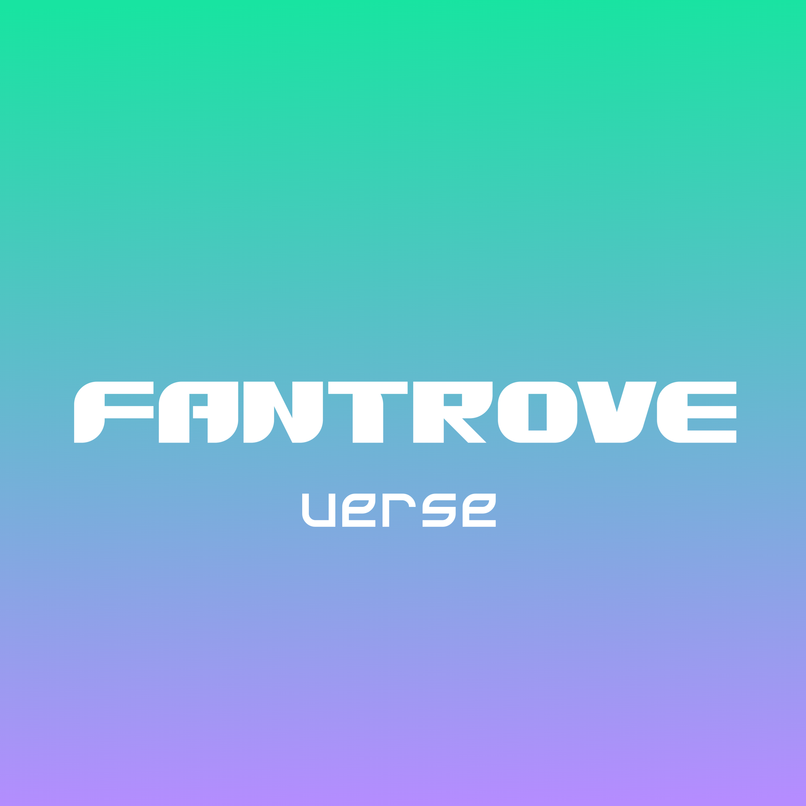

  

# 🌟 FanTrove – The Ultimate Collection of Special Characters, Emojis & Symbols! 

FanTrove is a website that gathers **special characters**, **emojis**, and **symbols** from all platforms in one place!  
No more wasting time searching across different sources—we make it easy and fast for you to copy and use them instantly. ✨  

## ❤️ Support FanTrove 
FanTrove is developed without any funding, and the developer has taken on the entire project independently.  
If you find this website useful or appreciate the work being done, you can show your support here:  

  

Every bit of support helps keep this project running and growing! 🚀  

## 🚀 What Makes FanTrove Unique?  
✔ **Effortless Usability** – Open the website and start using it instantly, no installation required!  
✔ **All-in-One Collection** – A vast selection of special characters, emojis, and symbols for game names, social media, Discord, and more.  
✔ **Continuous Updates** – New characters and symbols are frequently added to keep your collection fresh!  

## 🔧 **Current Website Status**  
⚠️ **The website is still under development and is not yet available for actual use.**  
⚠️ **No testing phase has been launched** – Please wait for further updates when it becomes accessible.  

## 🔮 What’s Coming Next?  
FanTrove is still evolving, and in the future, we plan to add exciting features such as:  
🎨 **Font Generator** – Type text and instantly transform it into stylish fonts.  
🔍 **Character & Symbol Search** – Easily find the special characters and symbols you need.  
📌 **Personal Collection Feature** – Save your favorite symbols for quick access later.  

## 📬 Stay Connected  
Follow us for updates and join the community:  
🌍 **Facebook Page:** [Ledp Aero Wings on Facebook](https://www.facebook.com/share/1HJRyK9kYr/)  
💬 **Discord Server:** [Join FanTrove](https://discord.gg/MMxQSZB3y3)  

📢 **Stay tuned for upcoming updates!**

## 📄 License

This project is licensed under the **Apache License 2.0** 📝

The license has been in effect since **July 22, 2025 (Thailand Time)** 🇹🇭

You can check out the full license text here:  
[http://www.apache.org/licenses/LICENSE-2.0](http://www.apache.org/licenses/LICENSE-2.0) 🔗

---

## ⚠️ License Change Notice

Previously, this project was proprietary software with **All Rights Reserved** 🚫  
But as of **July 22, 2025**, we've officially re-licensed it under the Apache License 2.0 🎉

This change opens up the project for collaboration, sharing, and wider community use —  
while still protecting the rights of the original creators 🙌

---

### 🙏 Attribution Reminder

If you modify, distribute, or build upon this software, please give proper credit to  
**Lédp Aero Wings and Nontakorn Nonsurat** — it means a lot! 💖